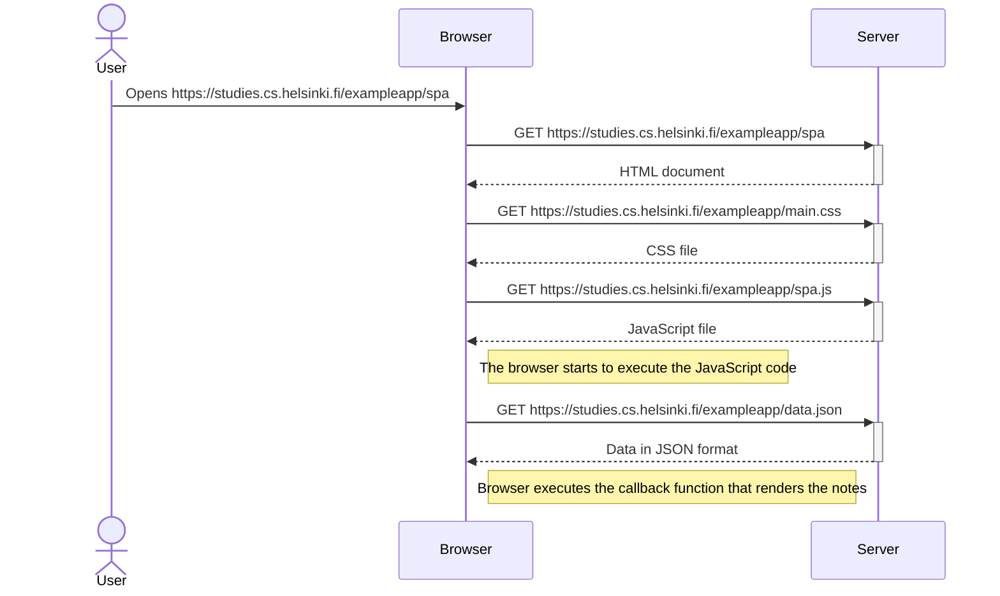

## Single Page App Sequence Diagram
 

```mermaid
sequenceDiagram
    actor u as User
    participant b as Browser
    participant s as Server

    u->>b: Opens https://studies.cs.helsinki.fi/exampleapp/spa
    b->>+s: GET https://studies.cs.helsinki.fi/exampleapp/spa
    s-->>-b: HTML document

    b->>+s: GET https://studies.cs.helsinki.fi/exampleapp/main.css
    s-->>-b: CSS file
    
    b->>+s: GET https://studies.cs.helsinki.fi/exampleapp/spa.js
    s-->>-b: JavaScript file
    
    Note right of b: The browser starts to execute the JavaScript code

    b->>+s: GET https://studies.cs.helsinki.fi/exampleapp/data.json
    s-->>-b: Data in JSON format

    Note right of b: Browser executes the callback function that renders the notes
```
