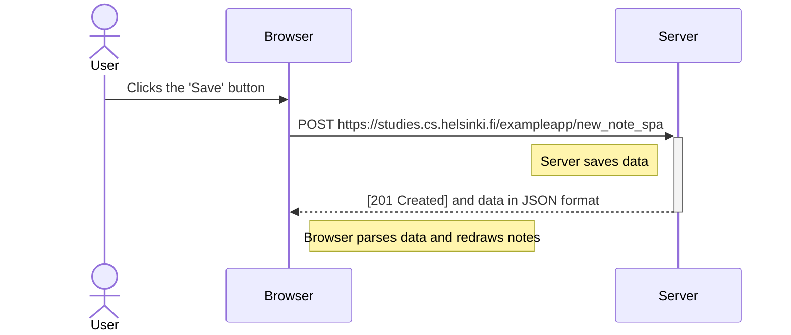

## New Note in Single Page App Sequence Diagram
 

```mermaid
sequenceDiagram
    actor u as User
    participant b as Browser
    participant s as Server

    u->>b: Clicks the 'Save' button
    b->>+s: POST https://studies.cs.helsinki.fi/exampleapp/new_note_spa
    Note left of s: Server saves data
    s-->>-b: [201 Created] and data in JSON format
    Note right of b: Browser parses data and redraws notes
```
